<div align="center">
  <h1>The VR-NeRF Eyeful Tower Dataset</h1>

  <p style="font-size:1.2em">
    <a href="https://eveneveno.github.io/lnxu"><strong>Linning Xu</strong></a> ·
    <a href="https://vasuagrawal.com"><strong>Vasu Agrawal</strong></a> ·
    <a href=""><strong>William Laney</strong></a> ·
    <a href=""><strong>Tony Garcia</strong></a> ·
    <a href="https://www.aayushbansal.xyz"><strong>Aayush Bansal</strong></a><br>
    <a href="https://changilkim.com/"><strong>Changil Kim</strong></a> ·
    <a href=""><strong>Samuel Rota Bulò</strong></a> ·
    <a href=""><strong>Lorenzo Porzi</strong></a> ·
    <a href=""><strong>Peter Kontschieder</strong></a><br>
    <a href="https://aljazbozic.github.io"><strong>Aljaž Božič</strong></a> ·
    <a href="http://dahua.site"><strong>Dahua Lin</strong></a> ·
    <a href="https://zollhoefer.com/"><strong>Michael Zollhöfer</strong></a> ·
    <a href="https://richardt.name"><strong>Christian Richardt</strong></a>
  </p>
  <p align="center" style="font-size:16px">ACM SIGGRAPH Asia 2023</p>


  <p align="center" style="margin: 2em auto;">
    <a href='https://vr-nerf.github.io' style='padding-left: 0.5rem;'></a>
    <a href='https://arxiv.org/abs/2311.02542'></a>
    <!--<a href='https://dl.acm.org/doi/10.1145/3592106'></a>
    <a href='https://youtu.be/GdvxgsITZOw'></a>-->
  </p>
</div>

## Dataset Overview

Scene                                                                                                                     | ver | cams                                                                                                                            | pos |   img |  2K&nbsp;EXRs                                                                                                                      | 8K+&nbsp;JPEGs                                                                                                                       | 4K&nbsp;JPEGs                                                                                                                          | 2K&nbsp;JPEGs
:------------------------------------------------------------------------------------------------------------------------ | --- | ------------------------------------------------------------------------------------------------------------------------------: | --: | ----: | ---------------------------------------------------------------------------------------------------------------------------------: | -----------------------------------------------------------------------------------------------------------------------------------: | -------------------------------------------------------------------------------------------------------------------------------------: | --------------------------------------------------------------------------------------------------------------------------------------:
[apartment][apartment_index]       | v2  | [22](https://fb-baas-f32eacb9-8abb-11eb-b2b8-4857dd089e15.s3.amazonaws.com/EyefulTower/apartment/images-jpeg-2k/collage.mp4)    | 180 | 3,960 | [123&nbsp;GB](https://fb-baas-f32eacb9-8abb-11eb-b2b8-4857dd089e15.s3.amazonaws.com/EyefulTower/apartment/images-2k/index.html)    |  [92&nbsp;GB](https://fb-baas-f32eacb9-8abb-11eb-b2b8-4857dd089e15.s3.amazonaws.com/EyefulTower/apartment/images-jpeg/index.html)    | [20&nbsp;GB](https://fb-baas-f32eacb9-8abb-11eb-b2b8-4857dd089e15.s3.amazonaws.com/EyefulTower/apartment/images-jpeg-4k/index.html)    | [5&nbsp;GB](https://fb-baas-f32eacb9-8abb-11eb-b2b8-4857dd089e15.s3.amazonaws.com/EyefulTower/apartment/images-jpeg-2k/index.html)
[kitchen][kitchen_index]           | v2* | [19](https://fb-baas-f32eacb9-8abb-11eb-b2b8-4857dd089e15.s3.amazonaws.com/EyefulTower/kitchen/images-jpeg-2k/collage.mp4)      | 318 | 6,024 | [190&nbsp;GB](https://fb-baas-f32eacb9-8abb-11eb-b2b8-4857dd089e15.s3.amazonaws.com/EyefulTower/kitchen/images-2k/index.html)      | [142&nbsp;GB](https://fb-baas-f32eacb9-8abb-11eb-b2b8-4857dd089e15.s3.amazonaws.com/EyefulTower/kitchen/images-jpeg/index.html)      | [29&nbsp;GB](https://fb-baas-f32eacb9-8abb-11eb-b2b8-4857dd089e15.s3.amazonaws.com/EyefulTower/kitchen/images-jpeg-4k/index.html)      | [8&nbsp;GB](https://fb-baas-f32eacb9-8abb-11eb-b2b8-4857dd089e15.s3.amazonaws.com/EyefulTower/kitchen/images-jpeg-2k/index.html)
[office1a][office1a_index]         | v1  |  [9](https://fb-baas-f32eacb9-8abb-11eb-b2b8-4857dd089e15.s3.amazonaws.com/EyefulTower/office1a/images-jpeg-2k/collage.mp4)     |  85 |   765 |  [24&nbsp;GB](https://fb-baas-f32eacb9-8abb-11eb-b2b8-4857dd089e15.s3.amazonaws.com/EyefulTower/office1a/images-2k/index.html)     |  [15&nbsp;GB](https://fb-baas-f32eacb9-8abb-11eb-b2b8-4857dd089e15.s3.amazonaws.com/EyefulTower/office1a/images-jpeg/index.html)     |  [3&nbsp;GB](https://fb-baas-f32eacb9-8abb-11eb-b2b8-4857dd089e15.s3.amazonaws.com/EyefulTower/office1a/images-jpeg-4k/index.html)     | [1&nbsp;GB](https://fb-baas-f32eacb9-8abb-11eb-b2b8-4857dd089e15.s3.amazonaws.com/EyefulTower/office1a/images-jpeg-2k/index.html)
[office1b][office1b_index]         | v2  | [22](https://fb-baas-f32eacb9-8abb-11eb-b2b8-4857dd089e15.s3.amazonaws.com/EyefulTower/office1b/images-jpeg-2k/collage.mp4)     |  71 | 1,562 |  [49&nbsp;GB](https://fb-baas-f32eacb9-8abb-11eb-b2b8-4857dd089e15.s3.amazonaws.com/EyefulTower/office1b/images-2k/index.html)     |  [35&nbsp;GB](https://fb-baas-f32eacb9-8abb-11eb-b2b8-4857dd089e15.s3.amazonaws.com/EyefulTower/office1b/images-jpeg/index.html)     |  [7&nbsp;GB](https://fb-baas-f32eacb9-8abb-11eb-b2b8-4857dd089e15.s3.amazonaws.com/EyefulTower/office1b/images-jpeg-4k/index.html)     | [2&nbsp;GB](https://fb-baas-f32eacb9-8abb-11eb-b2b8-4857dd089e15.s3.amazonaws.com/EyefulTower/office1b/images-jpeg-2k/index.html)
[office2][office2_index]           | v1  |  [9](https://fb-baas-f32eacb9-8abb-11eb-b2b8-4857dd089e15.s3.amazonaws.com/EyefulTower/office2/images-jpeg-2k/collage.mp4)      | 233 | 2,097 |  [66&nbsp;GB](https://fb-baas-f32eacb9-8abb-11eb-b2b8-4857dd089e15.s3.amazonaws.com/EyefulTower/office2/images-2k/index.html)      |  [46&nbsp;GB](https://fb-baas-f32eacb9-8abb-11eb-b2b8-4857dd089e15.s3.amazonaws.com/EyefulTower/office2/images-jpeg/index.html)      |  [9&nbsp;GB](https://fb-baas-f32eacb9-8abb-11eb-b2b8-4857dd089e15.s3.amazonaws.com/EyefulTower/office2/images-jpeg-4k/index.html)      | [2&nbsp;GB](https://fb-baas-f32eacb9-8abb-11eb-b2b8-4857dd089e15.s3.amazonaws.com/EyefulTower/office2/images-jpeg-2k/index.html)
[office_view1][office_view1_index] | v2  | [22](https://fb-baas-f32eacb9-8abb-11eb-b2b8-4857dd089e15.s3.amazonaws.com/EyefulTower/office_view1/images-jpeg-2k/collage.mp4) | 126 | 2,772 |  [87&nbsp;GB](https://fb-baas-f32eacb9-8abb-11eb-b2b8-4857dd089e15.s3.amazonaws.com/EyefulTower/office_view1/images-2k/index.html) |  [63&nbsp;GB](https://fb-baas-f32eacb9-8abb-11eb-b2b8-4857dd089e15.s3.amazonaws.com/EyefulTower/office_view1/images-jpeg/index.html) | [14&nbsp;GB](https://fb-baas-f32eacb9-8abb-11eb-b2b8-4857dd089e15.s3.amazonaws.com/EyefulTower/office_view1/images-jpeg-4k/index.html) | [4&nbsp;GB](https://fb-baas-f32eacb9-8abb-11eb-b2b8-4857dd089e15.s3.amazonaws.com/EyefulTower/office_view1/images-jpeg-2k/index.html)
[office_view2][office_view2_index] | v2  | [22](https://fb-baas-f32eacb9-8abb-11eb-b2b8-4857dd089e15.s3.amazonaws.com/EyefulTower/office_view2/images-jpeg-2k/collage.mp4) |  67 | 1,474 |  [47&nbsp;GB](https://fb-baas-f32eacb9-8abb-11eb-b2b8-4857dd089e15.s3.amazonaws.com/EyefulTower/office_view2/images-2k/index.html) |  [34&nbsp;GB](https://fb-baas-f32eacb9-8abb-11eb-b2b8-4857dd089e15.s3.amazonaws.com/EyefulTower/office_view2/images-jpeg/index.html) |  [7&nbsp;GB](https://fb-baas-f32eacb9-8abb-11eb-b2b8-4857dd089e15.s3.amazonaws.com/EyefulTower/office_view2/images-jpeg-4k/index.html) | [2&nbsp;GB](https://fb-baas-f32eacb9-8abb-11eb-b2b8-4857dd089e15.s3.amazonaws.com/EyefulTower/office_view2/images-jpeg-2k/index.html)
[riverview][riverview_index]       | v2  | [22](https://fb-baas-f32eacb9-8abb-11eb-b2b8-4857dd089e15.s3.amazonaws.com/EyefulTower/riverview/images-jpeg-2k/collage.mp4)    |  48 | 1,008 |  [34&nbsp;GB](https://fb-baas-f32eacb9-8abb-11eb-b2b8-4857dd089e15.s3.amazonaws.com/EyefulTower/riverview/images-2k/index.html)    |  [24&nbsp;GB](https://fb-baas-f32eacb9-8abb-11eb-b2b8-4857dd089e15.s3.amazonaws.com/EyefulTower/riverview/images-jpeg/index.html)    |  [5&nbsp;GB](https://fb-baas-f32eacb9-8abb-11eb-b2b8-4857dd089e15.s3.amazonaws.com/EyefulTower/riverview/images-jpeg-4k/index.html)    | [2&nbsp;GB](https://fb-baas-f32eacb9-8abb-11eb-b2b8-4857dd089e15.s3.amazonaws.com/EyefulTower/riverview/images-jpeg-2k/index.html)
[seating_area][seating_area_index] | v1  |  [9](https://fb-baas-f32eacb9-8abb-11eb-b2b8-4857dd089e15.s3.amazonaws.com/EyefulTower/seating_area/images-jpeg-2k/collage.mp4) | 168 | 1,512 |  [48&nbsp;GB](https://fb-baas-f32eacb9-8abb-11eb-b2b8-4857dd089e15.s3.amazonaws.com/EyefulTower/seating_area/images-2k/index.html) |  [36&nbsp;GB](https://fb-baas-f32eacb9-8abb-11eb-b2b8-4857dd089e15.s3.amazonaws.com/EyefulTower/seating_area/images-jpeg/index.html) |  [8&nbsp;GB](https://fb-baas-f32eacb9-8abb-11eb-b2b8-4857dd089e15.s3.amazonaws.com/EyefulTower/seating_area/images-jpeg-4k/index.html) | [2&nbsp;GB](https://fb-baas-f32eacb9-8abb-11eb-b2b8-4857dd089e15.s3.amazonaws.com/EyefulTower/seating_area/images-jpeg-2k/index.html)
[table][table_index]               | v1  |  [9](https://fb-baas-f32eacb9-8abb-11eb-b2b8-4857dd089e15.s3.amazonaws.com/EyefulTower/table/images-jpeg-2k/collage.mp4)        | 134 | 1,206 |  [38&nbsp;GB](https://fb-baas-f32eacb9-8abb-11eb-b2b8-4857dd089e15.s3.amazonaws.com/EyefulTower/table/images-2k/index.html)        |  [26&nbsp;GB](https://fb-baas-f32eacb9-8abb-11eb-b2b8-4857dd089e15.s3.amazonaws.com/EyefulTower/table/images-jpeg/index.html)        |  [6&nbsp;GB](https://fb-baas-f32eacb9-8abb-11eb-b2b8-4857dd089e15.s3.amazonaws.com/EyefulTower/table/images-jpeg-4k/index.html)        | [2&nbsp;GB](https://fb-baas-f32eacb9-8abb-11eb-b2b8-4857dd089e15.s3.amazonaws.com/EyefulTower/table/images-jpeg-2k/index.html)
[workshop][workshop_index]         | v1  |  [9](https://fb-baas-f32eacb9-8abb-11eb-b2b8-4857dd089e15.s3.amazonaws.com/EyefulTower/workshop/images-jpeg-2k/collage.mp4)     | 700 | 6,300 | [198&nbsp;GB](https://fb-baas-f32eacb9-8abb-11eb-b2b8-4857dd089e15.s3.amazonaws.com/EyefulTower/workshop/images-2k/index.html)     | [123&nbsp;GB](https://fb-baas-f32eacb9-8abb-11eb-b2b8-4857dd089e15.s3.amazonaws.com/EyefulTower/workshop/images-jpeg/index.html)     | [27&nbsp;GB](https://fb-baas-f32eacb9-8abb-11eb-b2b8-4857dd089e15.s3.amazonaws.com/EyefulTower/workshop/images-jpeg-4k/index.html)     | [8&nbsp;GB](https://fb-baas-f32eacb9-8abb-11eb-b2b8-4857dd089e15.s3.amazonaws.com/EyefulTower/workshop/images-jpeg-2k/index.html)
Total                                                                                                                     |     |                                                                                                                                 |     |       |  904&nbsp;GB                                                                                                                       |  636&nbsp;GB                                                                                                                         | 135&nbsp;GB                                                                                                                            | 37&nbsp;GB

\* v2 with 3 fewer cameras than standard configuration, i.e. only 19 cameras.

[apartment_index]: https://fb-baas-f32eacb9-8abb-11eb-b2b8-4857dd089e15.s3.amazonaws.com/EyefulTower/apartment/index.html
[kitchen_index]: https://fb-baas-f32eacb9-8abb-11eb-b2b8-4857dd089e15.s3.amazonaws.com/EyefulTower/kitchen/index.html
[office1a_index]: https://fb-baas-f32eacb9-8abb-11eb-b2b8-4857dd089e15.s3.amazonaws.com/EyefulTower/office1a/index.html
[office1b_index]: https://fb-baas-f32eacb9-8abb-11eb-b2b8-4857dd089e15.s3.amazonaws.com/EyefulTower/office1b/index.html
[office2_index]: https://fb-baas-f32eacb9-8abb-11eb-b2b8-4857dd089e15.s3.amazonaws.com/EyefulTower/office2/index.html
[office_view1_index]: https://fb-baas-f32eacb9-8abb-11eb-b2b8-4857dd089e15.s3.amazonaws.com/EyefulTower/office_view1/index.html
[office_view2_index]: https://fb-baas-f32eacb9-8abb-11eb-b2b8-4857dd089e15.s3.amazonaws.com/EyefulTower/office_view2/index.html
[riverview_index]: https://fb-baas-f32eacb9-8abb-11eb-b2b8-4857dd089e15.s3.amazonaws.com/EyefulTower/riverview/index.html
[seating_area_index]: https://fb-baas-f32eacb9-8abb-11eb-b2b8-4857dd089e15.s3.amazonaws.com/EyefulTower/seating_area/index.html
[table_index]: https://fb-baas-f32eacb9-8abb-11eb-b2b8-4857dd089e15.s3.amazonaws.com/EyefulTower/table/index.html
[workshop_index]: https://fb-baas-f32eacb9-8abb-11eb-b2b8-4857dd089e15.s3.amazonaws.com/EyefulTower/workshop/index.html

## Example Images

<table>
<thead>
  <tr>
    <th><a href="https://fb-baas-f32eacb9-8abb-11eb-b2b8-4857dd089e15.s3.amazonaws.com/EyefulTower/apartment/index.html">apartment</a></th>
    <th><a href="https://fb-baas-f32eacb9-8abb-11eb-b2b8-4857dd089e15.s3.amazonaws.com/EyefulTower/kitchen/index.html">kitchen</a></th>
    <th><a href="https://fb-baas-f32eacb9-8abb-11eb-b2b8-4857dd089e15.s3.amazonaws.com/EyefulTower/office1a/index.html">office1a</a></th>
    <th><a href="https://fb-baas-f32eacb9-8abb-11eb-b2b8-4857dd089e15.s3.amazonaws.com/EyefulTower/office1b/index.html">office1b</a></th>
  </tr>
</thead>
<tbody>
  <tr>
    <td width="25%"> <a href="https://fb-baas-f32eacb9-8abb-11eb-b2b8-4857dd089e15.s3.amazonaws.com/EyefulTower/apartment/index.html"> 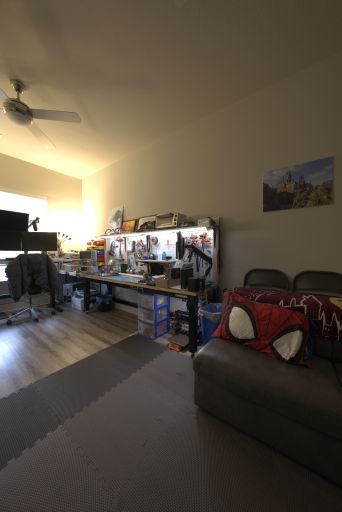 </a> </td>
    <td width="25%"> <a href="https://fb-baas-f32eacb9-8abb-11eb-b2b8-4857dd089e15.s3.amazonaws.com/EyefulTower/kitchen/index.html"> 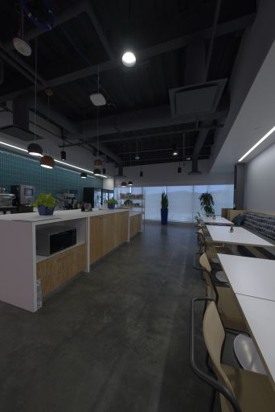 </a> </td>
    <td width="25%"> <a href="https://fb-baas-f32eacb9-8abb-11eb-b2b8-4857dd089e15.s3.amazonaws.com/EyefulTower/office1a/index.html"> 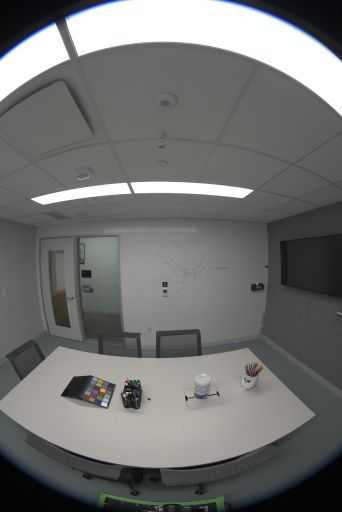 </a> </td>
    <td width="25%"> <a href="https://fb-baas-f32eacb9-8abb-11eb-b2b8-4857dd089e15.s3.amazonaws.com/EyefulTower/office1b/index.html"> 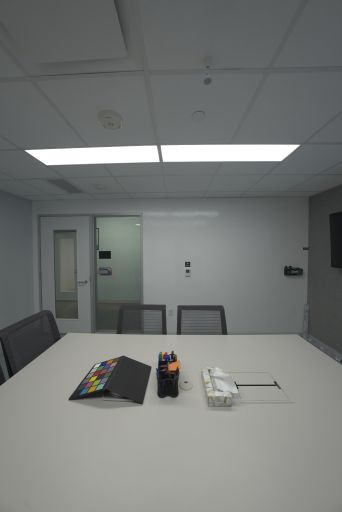 </a> </td>
  </tr>
</tbody>
</table>

<table>
<thead>
  <tr>
    <th><a href="https://fb-baas-f32eacb9-8abb-11eb-b2b8-4857dd089e15.s3.amazonaws.com/EyefulTower/office2/index.html">office2</a></th>
    <th><a href="https://fb-baas-f32eacb9-8abb-11eb-b2b8-4857dd089e15.s3.amazonaws.com/EyefulTower/office_view1/index.html">office_view1</a></th>
    <th><a href="https://fb-baas-f32eacb9-8abb-11eb-b2b8-4857dd089e15.s3.amazonaws.com/EyefulTower/office_view2/index.html">office_view2</a></th>
    <th><a href="https://fb-baas-f32eacb9-8abb-11eb-b2b8-4857dd089e15.s3.amazonaws.com/EyefulTower/riverview/index.html">riverview</a></th>
  </tr>
</thead>
<tbody>
  <tr>
    <td width="25%"> <a href="https://fb-baas-f32eacb9-8abb-11eb-b2b8-4857dd089e15.s3.amazonaws.com/EyefulTower/office2/index.html"> 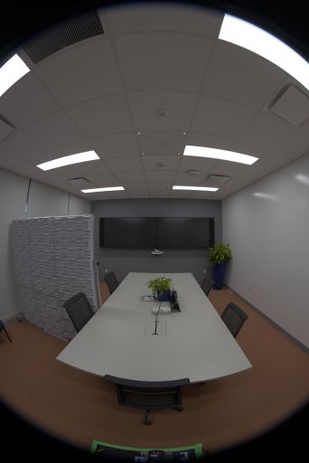 </a> </td>
    <td width="25%"> <a href="https://fb-baas-f32eacb9-8abb-11eb-b2b8-4857dd089e15.s3.amazonaws.com/EyefulTower/office_view1/index.html">  </a> </td>
    <td width="25%"> <a href="https://fb-baas-f32eacb9-8abb-11eb-b2b8-4857dd089e15.s3.amazonaws.com/EyefulTower/office_view2/index.html"> 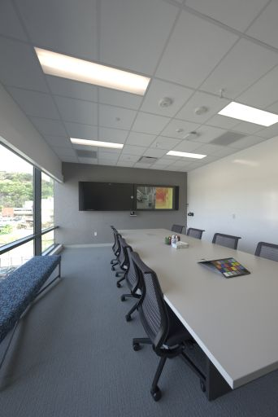 </a> </td>
    <td width="25%"> <a href="https://fb-baas-f32eacb9-8abb-11eb-b2b8-4857dd089e15.s3.amazonaws.com/EyefulTower/riverview/index.html"> 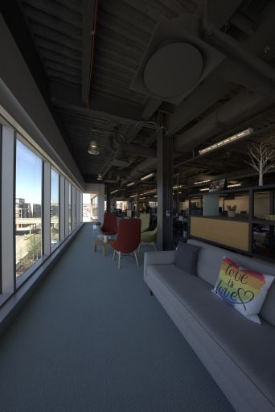 </a> </td>
  </tr>
</tbody>
</table>

<table>
<thead>
  <tr>
    <th><a href="https://fb-baas-f32eacb9-8abb-11eb-b2b8-4857dd089e15.s3.amazonaws.com/EyefulTower/seating_area/index.html">seating_area</a></th>
    <th><a href="https://fb-baas-f32eacb9-8abb-11eb-b2b8-4857dd089e15.s3.amazonaws.com/EyefulTower/table/index.html">table</a></th>
    <th><a href="https://fb-baas-f32eacb9-8abb-11eb-b2b8-4857dd089e15.s3.amazonaws.com/EyefulTower/workshop/index.html">workshop</a></th>
  </tr>
</thead>
<tbody>
  <tr>
    <td width="33%"> <a href="https://fb-baas-f32eacb9-8abb-11eb-b2b8-4857dd089e15.s3.amazonaws.com/EyefulTower/seating_area/index.html"> 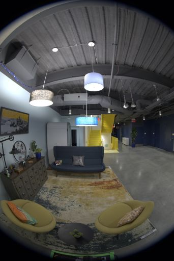 </a> </td>
    <td width="33%"> <a href="https://fb-baas-f32eacb9-8abb-11eb-b2b8-4857dd089e15.s3.amazonaws.com/EyefulTower/table/index.html"> 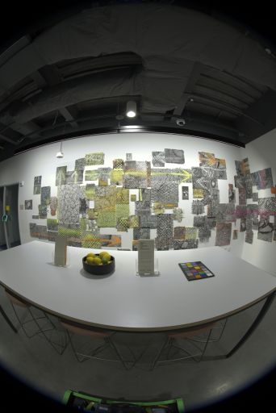 </a> </td>
    <td width="33%"> <a href="https://fb-baas-f32eacb9-8abb-11eb-b2b8-4857dd089e15.s3.amazonaws.com/EyefulTower/workshop/index.html"> 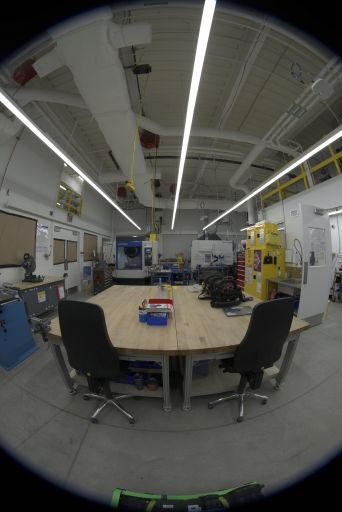 </a> </td>
  </tr>
</tbody>
</table>

## Capture Rig

All images in the dataset were taken with either Eyeful Tower V1 or V2 (as specified in [the overview table](#dataset-overview)). Eyeful Tower V1 comprises 9 fisheye cameras, whereas Eyeful Tower V2 comprises 22 pinhole cameras.

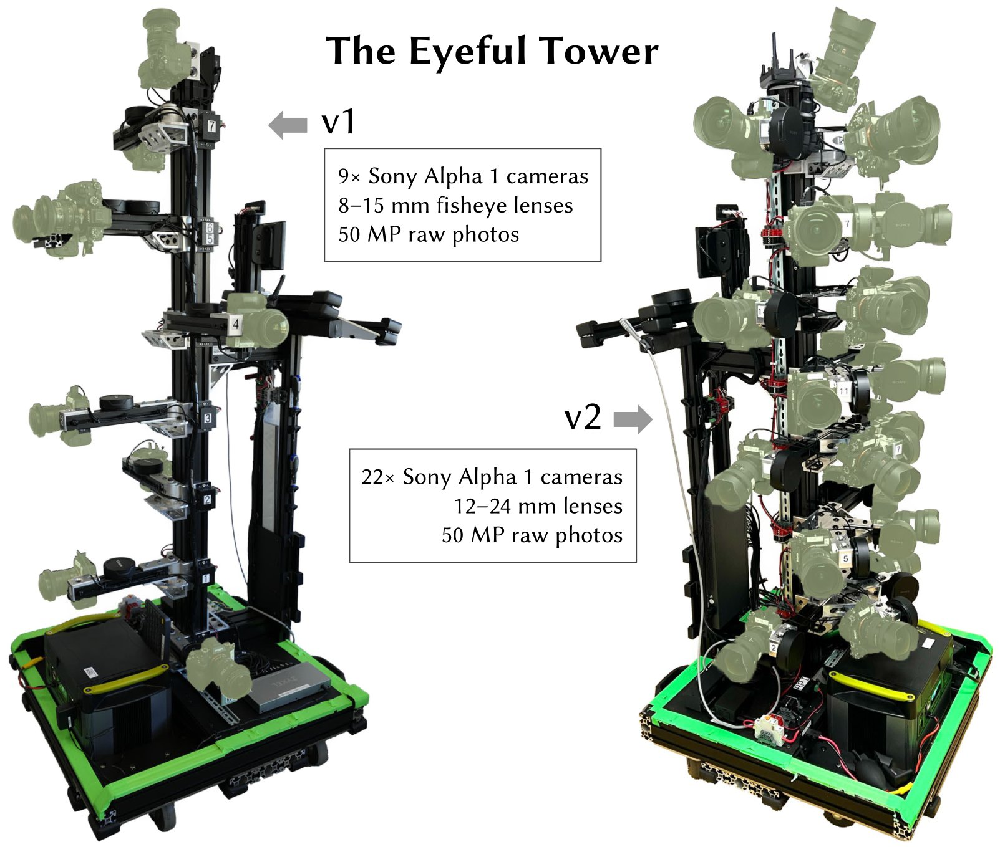

## Download instructions

The [Eyeful Tower dataset](https://fb-baas-f32eacb9-8abb-11eb-b2b8-4857dd089e15.s3.amazonaws.com/EyefulTower/index.html) is hosted on AWS S3, and can be explored with any browser or downloaded with standard software, such as [wget](https://www.gnu.org/software/wget/) or [curl](https://curl.se/).

However, for the fastest, most reliable download, we recommend using the AWS command line interface (AWS CLI), see [AWS CLI installation instructions](https://docs.aws.amazon.com/cli/latest/userguide/getting-started-install.html).

### Download a single scene (2K JPEGs only)
```
aws s3 cp --recursive --no-sign-request s3://fb-baas-f32eacb9-8abb-11eb-b2b8-4857dd089e15/EyefulTower/apartment/images-jpeg-2k/ apartment/images-jpeg-2k/
```
Alternatively, use “`sync`” to avoid transferring existing files:
```
aws s3 sync --no-sign-request s3://fb-baas-f32eacb9-8abb-11eb-b2b8-4857dd089e15/EyefulTower/apartment/images-jpeg-2k/ apartment/images-jpeg-2k/
```

For those interested in experimenting with specific cameras, we recommend viewing the [collage video](https://fb-baas-f32eacb9-8abb-11eb-b2b8-4857dd089e15.s3.amazonaws.com/EyefulTower/apartment/images-jpeg-2k/collage.mp4) first. This will help you identify which camera views you'd like to utilize. For example, for this apartment scene using the v2 capture rig, you might consider camera IDs 19, 20, 21 which are placed at the same height (see).


### Download all scenes (2K JPEGs only) using bash — 37 GB
```bash
for dataset in apartment kitchen office1a office1b office2 office_view1 office_view2 riverview seating_area table workshop; do
  mkdir -p $dataset/images-jpeg-2k;
  aws s3 cp --recursive --no-sign-request s3://fb-baas-f32eacb9-8abb-11eb-b2b8-4857dd089e15/EyefulTower/$dataset/images-jpeg-2k/ $dataset/images-jpeg-2k/;
done
```

### Download the entire Eyeful Tower dataset — 1.7 TB
```
aws s3 cp --recursive --no-sign-request s3://fb-baas-f32eacb9-8abb-11eb-b2b8-4857dd089e15/EyefulTower/ .
```

## Data Organization

Each scene is organized following this structure:
```
apartment
│
├── apartment-final.pdf      # Metashape reconstruction report
├── cameras.json             # Camera poses in KRT format (see below)
├── cameras.xml              # Camera poses exported from Metashape
├── images-2k                # HDR images at 2K resolution
│   ├── 10                   # First camera (bottom-most camera)
│   │   ├── 10_DSC0001.exr   # First image
│   │   ├── 10_DSC0010.exr   # Second image
│   │   ├── [...]            # More images
│   │   └── 10_DSC1666.exr   # Last image
│   ├── 11                   # Second camera
│   │   ├── 11_DSC0001.exr
│   │   ├── 11_DSC0010.exr
│   │   ├── [...]
│   │   └── 11_DSC1666.exr
│   ├── [...]                # More cameras
│   └── 31                   # Last camera (top of tower)
│       ├── 31_DSC0001.exr
│       ├── 31_DSC0010.exr
│       ├── [...]
│       └── 31_DSC1666.exr
├── images-jpeg [...]        # Full-resolution JPEG images
├── images-jpeg-2k           # JPEG images at 2K resolution
│   ├── [10 ... 31]
│   ├── [10 ... 31].mp4      # Camera visualization
│   └── collage.mp4          # Collage of all cameras
├── images-jpeg-4k [...]     # JPEG images at 4K resolution
├── mesh.jpg                 # Mesh texture (16K×16K)
├── mesh.mtl                 # Mesh material file
├── mesh.obj                 # Mesh in OBJ format
└── splits.json              # Training/testing splits
```

### HDR images (`images-2k/{camera}/*.exr`)

* High dynamic range images merged from 9-photo raw exposure brackets.
* Downsampled to “2K” resolution (1368×2048 pixels).
* Color space: DCI-P3 (linear)
* Stored as EXR images with uncompressed 32-bit floating-point numbers.
* All image filenames are prefixed with the camera name, e.g. `17_DSC0316.exr`.
* Images with filenames ending in the same number are captured at the same time.
* Some images may be missing, e.g. due to blurry images or images showing the capture operator that were removed.


#### Example code: reading EXR images to create JPEGs

```python
import os, cv2, numpy as np

# Enable OpenEXR support in OpenCV (https://github.com/opencv/opencv/issues/21326).
# This environment variable needs to be defined before the first EXR image is opened.
os.environ["OPENCV_IO_ENABLE_OPENEXR"] = "1"

# Read an EXR image using OpenCV.
img = cv2.imread("apartment/images-2k/17/17_DSC0316.exr", cv2.IMREAD_UNCHANGED)

# Apply white-balance scaling (Note: OpenCV uses BGR colors).
coeffs = np.array([0.726097, 1.0, 1.741252])  # apartment [RGB]
img = np.einsum("ijk,k->ijk", img, coeffs[::-1])

# Tonemap using sRGB curve.
linear_part = 12.92 * img
exp_part = 1.055 * (np.maximum(img, 0.0) ** (1 / 2.4)) - 0.055
img = np.where(img <= 0.0031308, linear_part, exp_part)

# Write resulting image as JPEG.
img = np.clip(255 * img, 0.0, 255.0).astype(np.uint8)
cv2.imwrite("apartment-17_DSC0316.jpg", img, params=[cv2.IMWRITE_JPEG_QUALITY, 100])
```


### JPEG images (`images-jpeg*/{camera}/*.jpg`)

* We provide images at three resolution levels:
  1. `images-jpeg/`: 5784 × 8660 = 50. megapixels — full original image resolution
  2. `images-jpeg-4k/`: 2736 × 4096 = 11.2 megapixels
  3. `images-jpeg-2k/`: 1368 × 2048 = 2.8 megapixels
* The JPEG images are white-balanced and tone-mapped versions of the HDR images.
See the code above for the details.
* Each scene uses white-balance settings derived from the ColorChecker that individually scale the RGB channels as follows:

  Scene        |      RGB scale factors
  ------------ | :------------------------:
  apartment    | `0.726097, 1.0, 1.741252`
  kitchen      | `0.628143, 1.0, 2.212346`
  office1a     | `0.740846, 1.0, 1.750224`
  office1b     | `0.725535, 1.0, 1.839938`
  office2      | `0.707729, 1.0, 1.747833`
  office_view1 | `1.029089, 1.0, 1.145235`
  office_view2 | `0.939620, 1.0, 1.273549`
  riverview    | `1.077719, 1.0, 1.145992`
  seating_area | `0.616093, 1.0, 2.426888`
  table        | `0.653298, 1.0, 2.139514`
  workshop     | `0.709929, 1.0, 1.797705`


### Camera calibration in KRT format (`cameras.json`)

This JSON file has the basic structure `{"KRT": [<one object per image>]}`, where each image object has the following properties:
* `width`: image width, in pixels (usually 5784)
* `height`: image height, in pixels (usually 8660)
* `cameraId`: filename component for this image (e.g. `"0/0_REN0001"`); to get a complete path, use `"{scene}/{imageFormat}/{cameraId}.{extension}"` for:
  * `scene`: any of the 11 scene names,
  * `imageFormat`: one of `"images-2k"`, `"images-jpeg-2k"`, `"images-jpeg-4k"`, or `"images-jpeg"`
  * `extension`: file extension, `jpg` for JPEGs, `exr` for EXR images (HDR)
* `K`: 3×3 intrinsic camera matrix for full-resolution image (**column-major**)
* `T`: 4×4 world-to-camera transformation matrix (**column-major**)
* `distortionModel`: lens distortion model used:
  * `"Fisheye"` for fisheye images (Eyeful v1)
  * `"RadialAndTangential"` for pinhole images (Eyeful v2)
* `distortion`: lens distortion coefficients for use with OpenCV’s `cv2.undistort` function
  * fisheye images (Eyeful v1): `[k1, k2, k3, _, _, _, p1, p2]`
    * **Note:** The projection model is an ideal (equidistant) fisheye model.
  * pinhole images (Eyeful v2): `[k1, k2, p1, p2, k3]` (same order as `cv2.undistort`)

* `frameId`: position index during capture (consecutive integers)
  * all images taken at the same time share the same `frameId`
* `sensorId`: Metashape sensor ID (_aka_ camera) of this image
  * all images taken by the same camera share the same `sensorId`
* `cameraMasterId` (optional): Metashape camera ID for the master camera (in rig calibration) at this position/frame
  * all images taken at the same time share the same `cameraMasterId`
* `sensorMasterId` (optional): Metashape sensor ID for the master camera in rig calibration
  * should have the same value for all cameras except the master camera (usually `"6"` for Eyeful v1, `"13"` for Eyeful v2).

World coordinate system: right-handed, y-up, `y=0` is ground plane, units are in meters.


### Camera calibration in Metashape XML format (`cameras.xml`)

* Camera calibration data exported directly from Metashape, using its proprietary file format.


### Reconstructed 3D mesh (`mesh.*`)

* Textured mesh in OBJ format, exported from Metashape and created from the full-resolution JPEG images.

* World coordinate system: right-handed, y-up, `y=0` is ground plane, units are in meters.


### Training/testing splits (`splits.json`)

* Contains lists of images for training (`"train"`) and testing (`"test"`).
* All images of one camera are held out for testing: camera `5` for Eyeful v1, and camera `17` for Eyeful v2.


## Citation
If you use any data from this dataset or any code released in this repository, please cite the VR-NeRF paper.

```bibtex
@InProceedings{VRNeRF,
  author    = {Linning Xu and
               Vasu Agrawal and
               William Laney and
               Tony Garcia and
               Aayush Bansal and
               Changil Kim and
               Rota Bulò, Samuel and
               Lorenzo Porzi and
               Peter Kontschieder and
               Aljaž Božič and
               Dahua Lin and
               Michael Zollhöfer and
               Christian Richardt},
  title     = {{VR-NeRF}: High-Fidelity Virtualized Walkable Spaces},
  booktitle = {SIGGRAPH Asia Conference Proceedings},
  year      = {2023},
  doi       = {10.1145/3610548.3618139},
  url       = {https://vr-nerf.github.io},
}
```

## License
Creative Commons Attribution-NonCommercial (CC BY-NC) 4.0,
as found in the [LICENSE file](LICENSE).

[[Terms of Use](https://opensource.fb.com/legal/terms/)]
[[Privacy Policy](https://opensource.fb.com/legal/privacy)]
